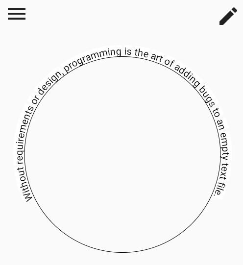

# text_x_arc

The Helper for draws Arc Text on canvas

#



Inspired from [flutter_arc_text](https://developers.mews.com/flutter-how-to-draw-text-along-arc/).


If you just need a way to draw text along an arc, just go with [flutter_arc_text](https://pub.dev/packages/flutter_arc_text).


This package was develop for my special use case so maybe it not suits you.

Consider this package if you need:

- draw text along an arc on canvas
- care about start angle and end angle
- remove all letter out of range (from start angle to end angle)
- center align only when the text shorter than the arc
- customize letter spacing
- tracking what happens on the canvas when draw an arc text.
#

## Basic usage
```
import 'package:flutter/material.dart';
import 'package:flutter/widgets.dart';
import 'package:text_x_arc/text_x_arc.dart';

main() {
  runApp(CustomPaint(
    painter: MyPainter(),
  ));
}

class MyPainter extends CustomPainter {
  @override
  void paint(Canvas canvas, Size size) {
    final centerPos = Offset(size.width / 2, size.height / 2);
    TextPainter textPainter = TextPainter(
        textAlign: TextAlign.justify, textDirection: TextDirection.ltr);
    XArcTextDrawer.draw(
        canvas: canvas,
        centerPos: centerPos,
        radius: 200,
        text:
            'Without requirements or design, programming is the art of adding bugs to an empty text file.',
        textStyle: TextStyle(color: Colors.black, fontSize: 20),
        textPainter: textPainter);
  }

  @override
  bool shouldRepaint(covariant CustomPainter oldDelegate) => true;
}

```

Checkout the  [playground](https://github.com/taodo2291/xarctext_flutter/example/lib/main.dart) example for more information.

Feel free to report bugs or suggest any improvement.
#

## Author
Viet Nguyen - taodo2291@gmail.com
#twitter - @taodo2291
